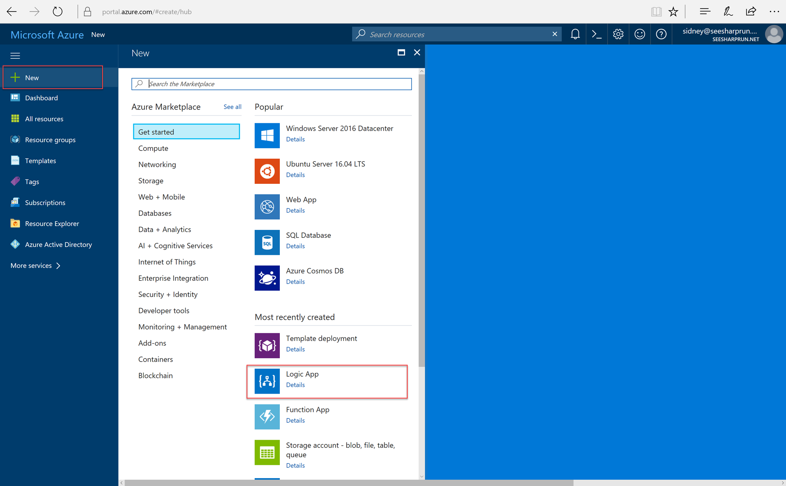
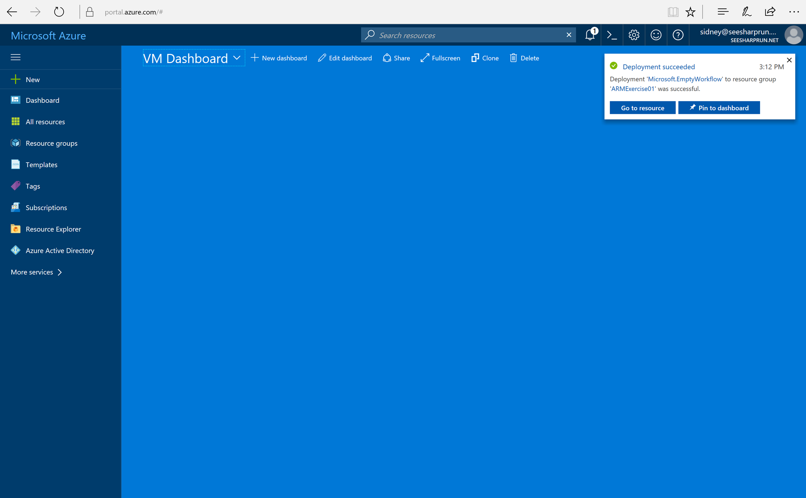
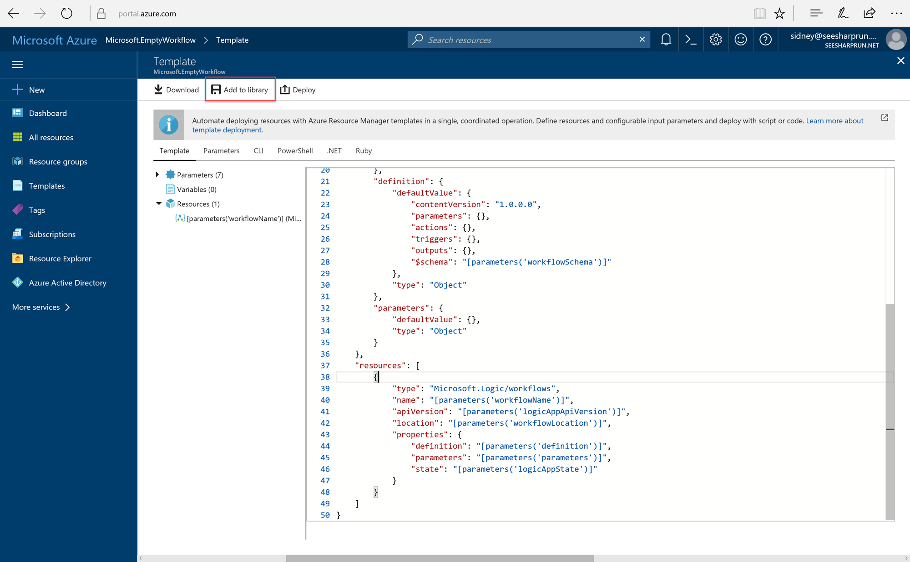
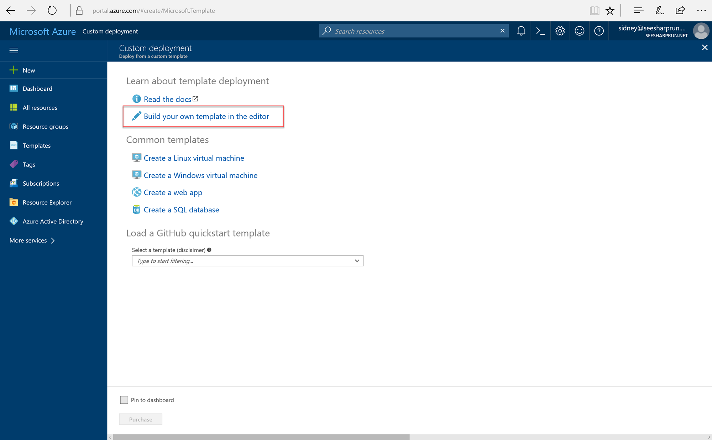
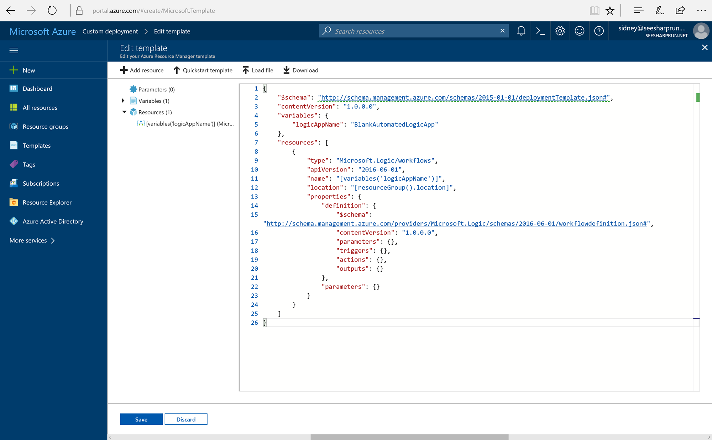
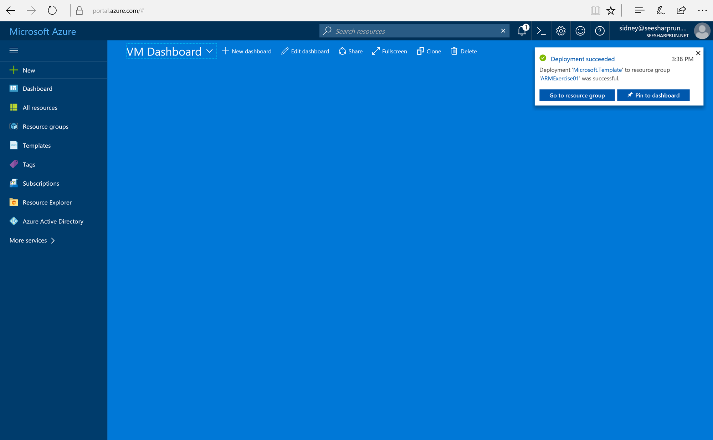

## Exercise: Deploying an Empty Logic App Using the Standard Logic App ARM Template

In this exercise, we will deploy a blank Logic App using a simple ARM template. We will use the portal wizard to create a new deployment using an ARM template.

### View the Default ARM Template for a New Logic App

1. Navigate to the Azure Portal using your preferred browser and this URL: <http://portal.azure.com>.
1. In the left navigation bar, click the **New** button and then select the **Logic App** option.
    
    > You may need to search for the **Logic App** option if it is not listed in your recent choices.
1. In the **Create logic app** blade, fill out the form with the following values:
    - **Name**: BlankLogicApp
    - **Subscription**: Select your current subscription
    - **Resource group**: ARMExercise01
    - **Location**: Select an international datacenter
    - **Log Analytics**: Off
1. Click the **Create** button.
1. While the Logic App is being created, you will see a notification indicating that the deployment has started. Once the deployment has completed, you will see another notification indicating that the deployment is complete with a link to the deployment template.
1. Click the **Microsoft.EmptyWorkflow** link to open the ARM template used to create an Empty Logic App.
    
    > If the notification has disappeared, you can click the **bell** icon to view past notifications.
1. In the **Microsoft.EmptyWorkflow** blade, click the **View Template** button.
1. Look at the template's **resources** and **parameters**.
    > This is the template used by the Azure Portal to create new Logic App instances
1. Click the **Add to Library** button at the top of the **Template** blade.
    
1. In the **Add template** blade, provide any value in the **Name** and **Description** fields. Click the **Save** button to save the template.

### Deploy a Blank Logic App Using an ARM Template

1. In a new browser window/tab, navigate to the portal again using this URL: <https://portal.azure.com/#create/Microsoft.Template>.
1. In the **Custom deployment** blade, click the **Build your own template in the editor** link.
    
1. In the template editor, paste in the following JSON template:
    ```javascript
    {
        "$schema": "http://schema.management.azure.com/schemas/2015-01-01/deploymentTemplate.json#",
        "contentVersion": "1.0.0.0",
        "variables": {
            "logicAppName": "BlankAutomatedLogicApp"
        },
        "resources": [
            {
                "type": "Microsoft.Logic/workflows",
                "apiVersion": "2016-06-01",
                "name": "[variables('logicAppName')]",
                "location": "[resourceGroup().location]",
                "properties": {
                    "definition": {
                        "$schema": "http://schema.management.azure.com/providers/Microsoft.Logic/schemas/2016-06-01/workflowdefinition.json#",
                        "contentVersion": "1.0.0.0",
                        "parameters": {},
                        "triggers": {},
                        "actions": {},
                        "outputs": {}
                    },
                    "parameters": {}
                }
            }
        ]
    }
    ```
    
1. Click the **Save** button.
1. In the **Custom deployment** form, provide the following values:
    - **Subscription**: Select your current subscription
    - **Resource group**: ARMExercise01
    - *I agree to the terms and conditions stated above*: Checkmark to indicate yes 
1. Click the **Purchase** button to deploy the ARM template.
1. Once the deployment is complete, click the **Go to resource group** button to view the deployed resource.
    
1. In the **Resource group** blade, select the **BlankAutomatedLogicApp** resource to view your deployed Logic App.

### Clean-Up Your Resource Group

1. In the left navigation bar, click the **More Services** button and then select the **Resource groups** option.
    
1. In the **Resource groups** blade, right-click the **ARMExercise01** resource group and select the **Delete resource group** option.
1. In the confirmation blade, enter the name of your resource group (**ARMExercise01**) and then click the **Delete** button.

### Bonus Exercise: Deploy a Simple Logic App

Try deploying another Logic App using an ARM Template. The ARM Template below will deploy a Logic App with a single trigger and action. The Logic App will issue an HTTP Request to the <http://httpbin.org> API once every 15 minutes to obtain a generated UUID value. You should ensure that you delete this Logic App after you are done.

```javascript
{
    "$schema": "http://schema.management.azure.com/schemas/2015-01-01/deploymentTemplate.json#",
    "contentVersion": "1.0.0.0",
    "variables": {
        "logicAppName": "SimpleAutomatedLogicApp"
    },
    "resources": [
        {
            "type": "Microsoft.Logic/workflows",
            "apiVersion": "2016-06-01",
            "name": "[variables('logicAppName')]",
            "location": "[resourceGroup().location]",
            "properties": {
                "definition": {
                    "$schema": "http://schema.management.azure.com/providers/Microsoft.Logic/schemas/2016-06-01/workflowdefinition.json#",
                    "contentVersion": "1.0.0.0",
                    "parameters": {},
                    "triggers": {
                        "FiveMinuteFrequency": {
                            "type": "Recurrence",
                            "recurrence": {
                                "frequency": "Minute",
                                "interval": 15
                            }
                        }
                    },
                    "actions": {
                        "GetUUID": {
                            "inputs": {
                                "method": "GET",
                                "uri": "http://httpbin.org/uuid"
                            },
                            "runAfter": {},
                            "type": "Http"
                        }
                    },
                    "outputs": {}
                },
                "parameters": {}
            }
        }
    ]
}
```