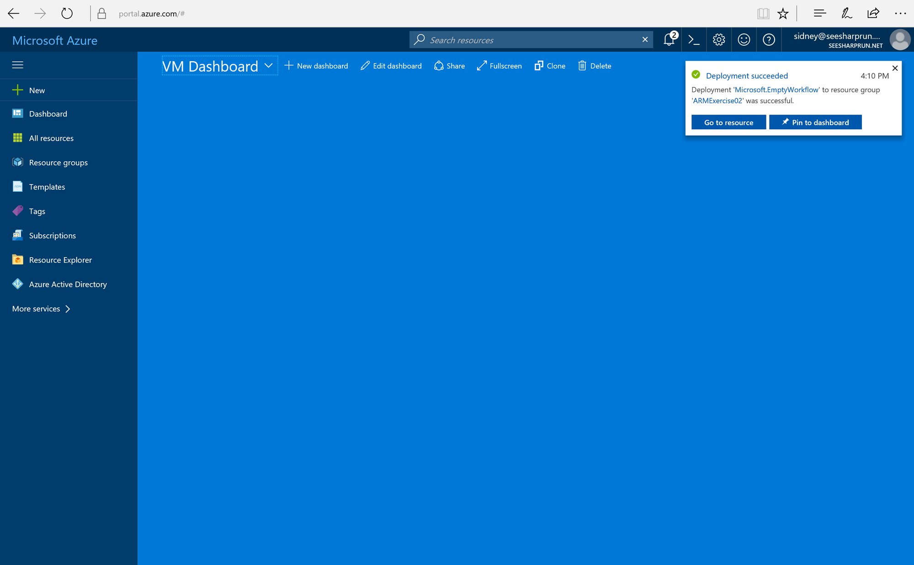
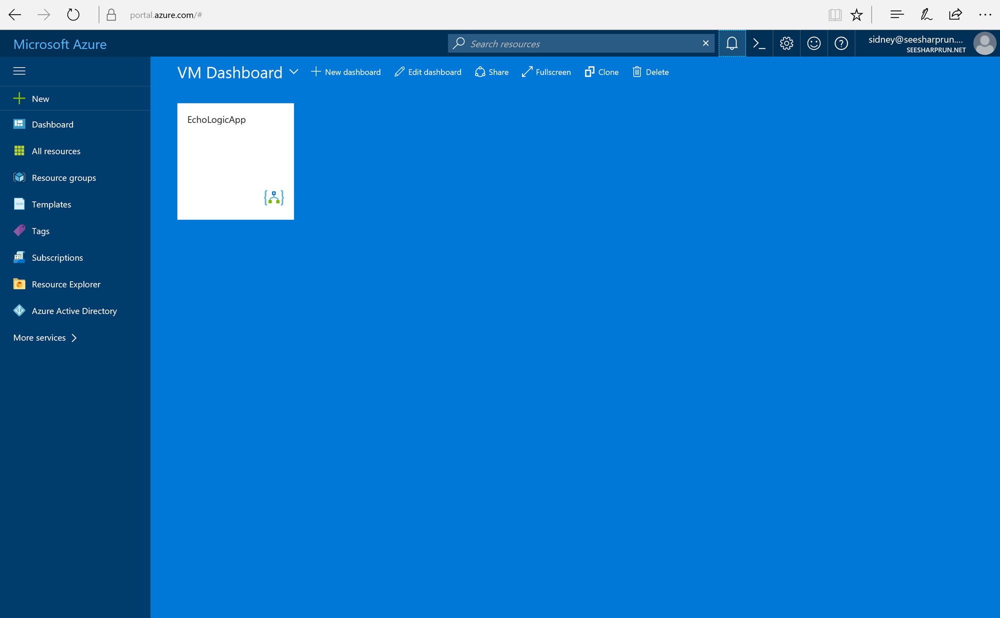
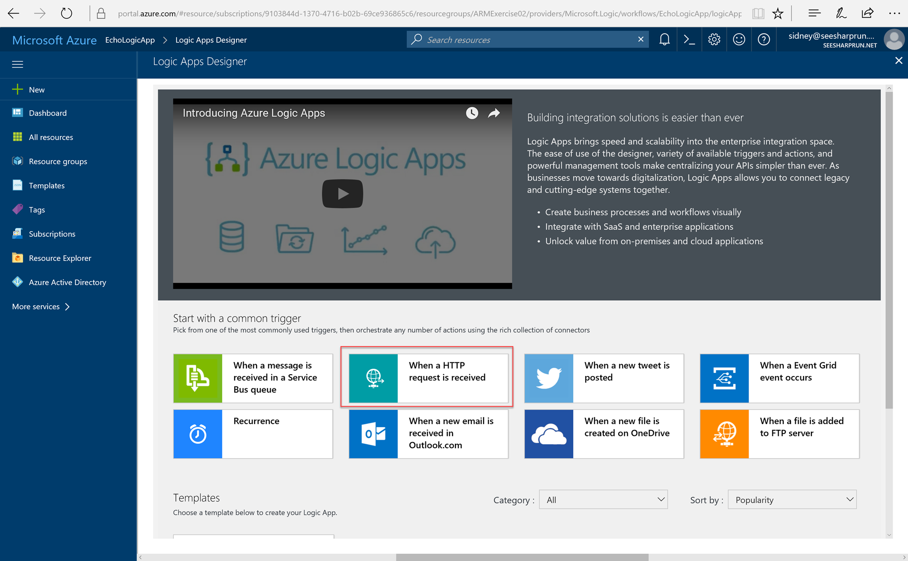
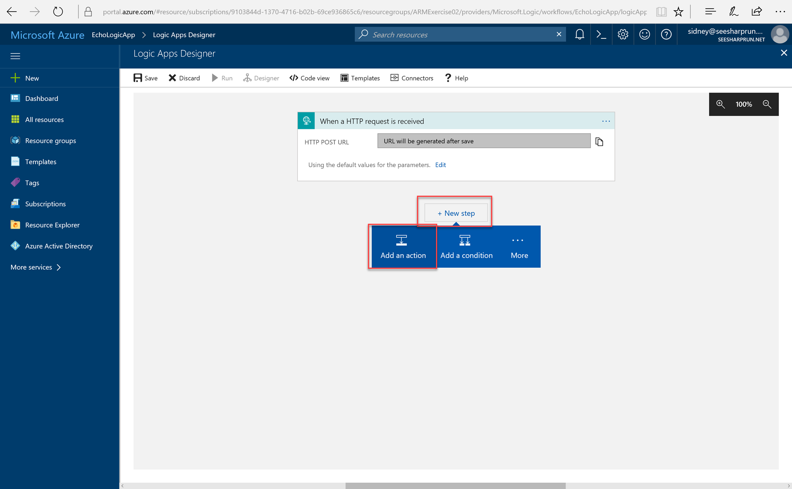
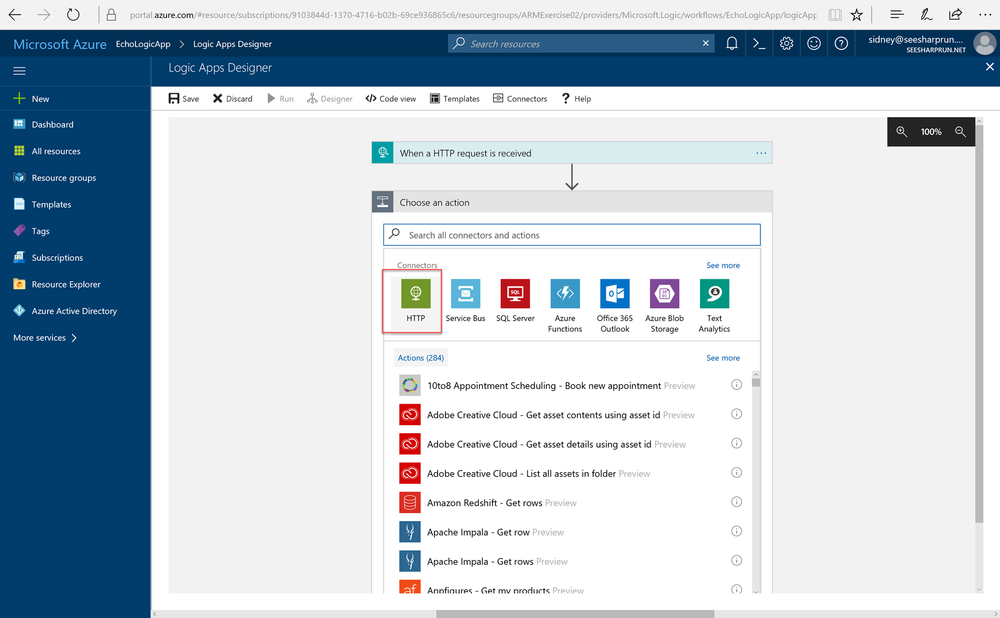
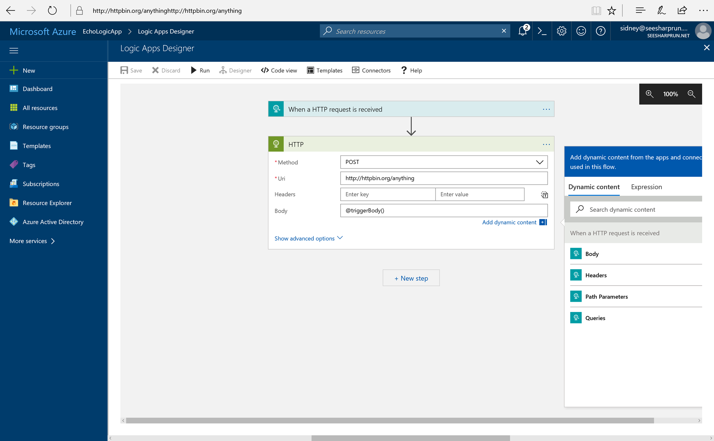
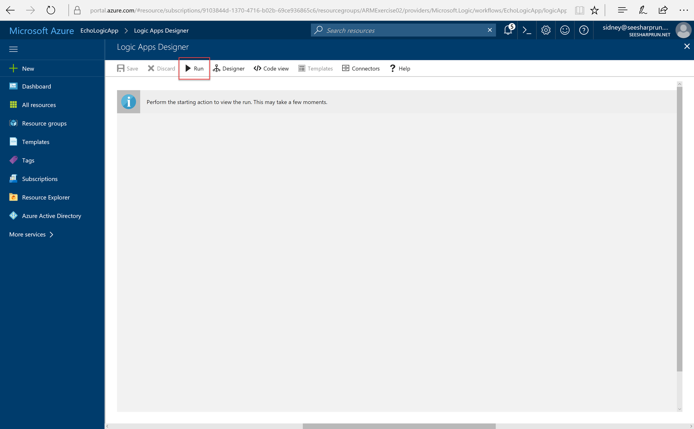
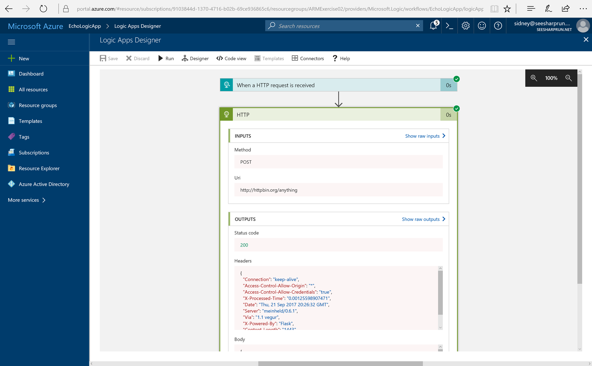
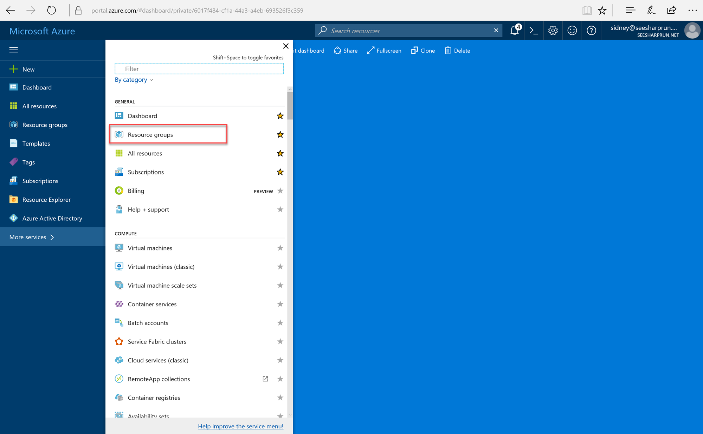

## Exercise: Reverse Engineering an ARM Template From an Existing Logic App

In this exercise, we will

### Create a Logic App

1. Navigate to the Azure Portal using your preferred browser and this URL: <http://portal.azure.com>.
1. In the left navigation bar, click the **New** button and then select the **Logic App** option.
1. In the **Create logic app** blade, fill out the form with the following values:
    - **Name**: EchoLogicApp
    - **Subscription**: Select your current subscription
    - **Resource group**: ARMExercise02
    - **Location**: Select your furthest domestic datacenter
    - **Log Analytics**: Off
1. Click the **Create** button.
1. While the Logic App is being created, you will see a notification indicating that the deployment has started. Once the deployment has completed, you will see another notification indicating that the deployment is complete.
1. Click the **Pin to dashboard** option in the notification.
    
1. Click the **EchoLogicApp** tile on the dashboard.
    
1. The Logic App will open immediately to the **Logic App Designer** blade, select the **When a HTTP request is received** option.
    
1. In the **Logic App Designer**, click the **+ New Step** and **Add an Action** options.
    
1. In the **Choose an action** section, select the **HTTP** Connector.
    
1. In the **HTTP** section, select the **HTTP -HTTP** option.
    
1. In the **HTTP** form, provide the following values:
    - **Method**: POST
    - **Url**: http://httpbin.org/anything
    - **Body**: @triggerBody()
    
1. Click the **Save** button.
1. Click the **Run** button to validate the Logic App.
    
1. After the Logic App has ran, you should see the results of the validation run.
    
    > You may need to expand the **HTTP** section to view the response from the web server.

### Reverse-Engineer the Logic App's Template

1.

### Deploy the Logic App Template

1.

### Clean-Up Your Resource Group

1. In the left navigation bar, click the **More Services** button and then select the **Resource groups** option.
    
1. In the **Resource groups** blade, right-click the **ARMExercise02** resource group and select the **Delete resource group** option.
1. In the confirmation blade, enter the name of your resource group (**ARMExercise02**) and then click the **Delete** button.

---

### Bonus Exercise: 

