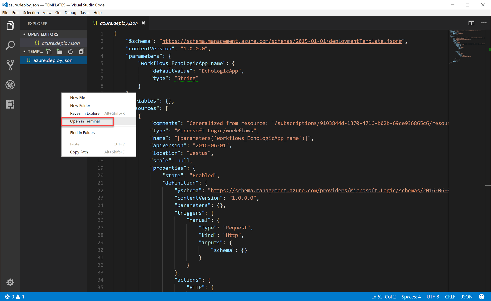

## Exercise: Reverse Engineering an ARM Template From an Existing Logic App

In this exercise, we will create a Logic App and then reverse engineer an ARM template from the Logic App.

### Install the Azure CLI 2.0

1. Download and install the Azure CLI from this link: <https://aka.ms/InstallAzureCliWindows>.
1. Once installed, open a command prompt on your local machine.
1. In the command prompt, run the following command to validate your Azure CLI installation:
    ```shell
    az --help
    ```

### Create a Logic App

1. Navigate to the Azure Portal using your preferred browser and this URL: <http://portal.azure.com>.
1. In the left navigation bar, click the **New** button and then select the **Logic App** option.
1. In the **Create logic app** blade, fill out the form with the following values:
    - **Name**: EchoLogicApp
    - **Subscription**: Select your current subscription
    - **Resource group**: ARMExercise02
    - **Location**: Select your furthest domestic region
    - **Log Analytics**: Off
1. Click the **Create** button.
1. While the Logic App is being created, you will see a notification indicating that the deployment has started. Once the deployment has completed, you will see another notification indicating that the deployment is complete.
1. Click the **Pin to dashboard** option in the notification.
    
1. Click the **EchoLogicApp** tile on the dashboard.
    
1. The Logic App will open immediately to the **Logic App Designer** blade, select the **When a HTTP request is received** option.
    
1. In the **Logic App Designer**, click the **+ New Step** and **Add an Action** options.
    
1. In the **Choose an action** section, select the **HTTP** Connector.
    
1. In the **HTTP** section, select the **HTTP -HTTP** option.
    
1. In the **HTTP** form, provide the following values:
    - **Method**: POST
    - **Url**: http://httpbin.org/anything
    - **Body**: @triggerBody()
    
1. Click the **Save** button.
1. Click the **Run** button to validate the Logic App.
    
1. After the Logic App has ran, you should see the results of the validation run.
    
    > You may need to expand the **HTTP** section to view the response from the web server.

### Reverse-Engineer the Logic App's Template

1. Scroll to the left of the Logic App blade and click the **Automation Script** button.
    
1. Copy the ARM template generated and displayed in the **Automation Script** blade's editor.
    
1. Do not close your browser window.

### Deploy the Logic App Template

1. Open **Visual Studio Code**
1. Click the **Extensions** button.
    
1. Search for the **Azure Resource Manager Tools** extension. Click the **Install** button to install the extension.
    
1. Click the **Reload** button to reload the **Visual Studio Code** editor with the extension enabled.
    
1. In the **Explorer** pane, open an empty folder on your local machine where you will save your work.
    
1. Create a new file named **azure.deploy.json**.
    
1. Paste the JSON template you copied earlier in this lab into the newly created file.
1. Right-click the **Explorer** pane and select the **Open in Terminal** option.
    
1. In the open terminal pane, execute the following command to begin the login process:
    ```shell
    az login
    ```
    
1. Follow the instructions to authenticate within the CLI.
    > Typically the instructions will have you visit a website (ex. https://aka.ms/devicelogin) and then authenticate at the website directly.
1. Once authenticated, run the following command to view your current subscription:
    ```shell
    az account show
    ```
    > If the wrong subscription is selected, you can use the ``az account set --subscription SubscriptionName`` command to change the currently selected subscription. More information about this command can be found here [https://docs.microsoft.com/en-us/cli/azure/account](https://docs.microsoft.com/en-us/cli/azure/account?view=azure-cli-latest#az_account_set)
1. Observe the name of the single parameter in the ARM Template. This parameter name will be used in the next step.
1. Deploy the ARM Template using the below command:
    ```shell
    az group deployment create --resource-group ARMExercise02 --template-file azure.deploy.json --parameters workflows_EchoLogicApp_name=EchoAutomatedLogicApp
    ```
    > If your ARM Template has a parameter with a different name, use that name as a substitute for the ``workflows_EchoLogicApp_name`` paramter specified in the command.
1. View your newly created Logic App using the Azure Portal.
1. Run the new Logic App to validate that it works correctly.

### Clean-Up Your Resource Group

1. In the left navigation bar, click the **More Services** button and then select the **Resource groups** option.
    
1. In the **Resource groups** blade, right-click the **ARMExercise02** resource group and select the **Delete resource group** option.
1. In the confirmation blade, enter the name of your resource group (**ARMExercise02**) and then click the **Delete** button.

---

### Bonus Exercise: Reverse Engineer Multiple Logic Apps

Now that you have two Logic Apps in your resource group, you should use the Automation Script button in the resource group to create an ARM Template that deploys both Logic Apps. Deploy this template to the same resource group as your previous Logic Apps. If you use the same name, observe what happens. If you use a different name, observe how the deployment changes.